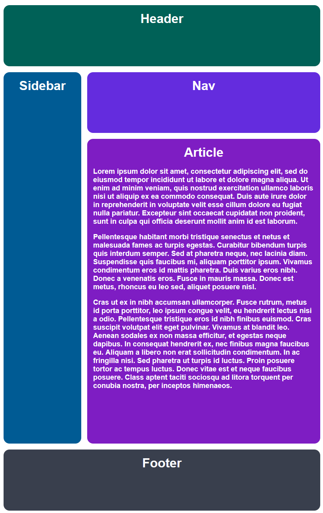
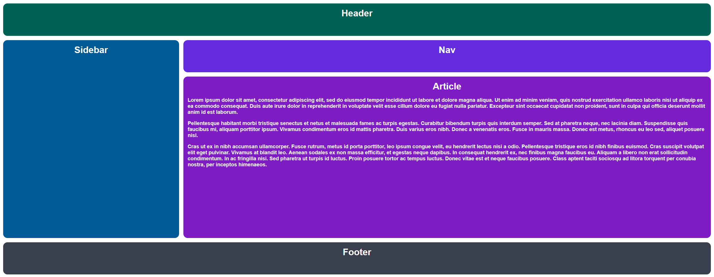

# Diseño «Holy Grail» adaptable con CSS Grid

En este ejercicio construirás con **CSS Grid** la distribución de una página con cabecera, barra lateral, navegación, artículo y pie de página. El objetivo es que sus columnas se estrechen o ensanchen con la ventana y que el contenido siga siendo legible.

El archivo `index.html` ya contiene todos los elementos. En `style.css` están preparados los colores, la tipografía y algunas posiciones de los elementos. Tu trabajo es completar los estilos de `.container`. No necesitas cambiar el HTML ni instalar nada.

## Resultado esperado

**Con el navegador estrecho:**



**Con el navegador ancho:**



Las dos imágenes muestran **la misma distribución de dos columnas y cuatro filas**. Lo que cambia es el espacio disponible: en la ventana estrecha el texto del artículo ocupa más líneas y su fila crece. No necesitas crear un diseño distinto para cada ancho.

## Cómo empezar

1. Abre `index.html` en el navegador y `style.css` en tu editor.
2. Localiza `.container` y observa las reglas que ya tienen `.header`, `.sidebar` y `.footer`.
3. Haz que `.container` sea una cuadrícula. Después define sus dos columnas, cuatro filas y la separación entre ellas.
4. Guarda el CSS, recarga el navegador y prueba varios anchos de ventana.

## Objetivos y comprobación

- Hay **dos columnas**. La segunda es tres veces más ancha que la primera.
- Hay **cuatro filas**. La tercera recibe una proporción cinco veces mayor que cada una de las otras.
- La separación entre celdas es de **15 px**.
- Las columnas y filas usan tamaños flexibles, sin fijar sus pistas en píxeles.
- La cabecera y el pie ocupan todo el ancho; la barra lateral ocupa las dos filas centrales.
- Al estrechar la ventana, las columnas se adaptan y la tercera fila puede crecer para alojar el texto del artículo, sin que este se salga de su caja.

## Pistas progresivas

<details>
<summary>Pista 1: identifica qué falta</summary>

Las reglas de `.header`, `.sidebar` y `.footer` ya indican qué líneas de la cuadrícula deben ocupar. Esas reglas solo se podrán aplicar cuando su contenedor sea un Grid. Revisa qué propiedades necesita `.container` para definir las pistas.

</details>

<details>
<summary>Pista 2: propiedades CSS sin valores</summary>

```css
.container {
  /* Conserva las declaraciones que ya existen aquí. */
  display: ;
  grid-template-columns: ;
  grid-template-rows: ;
  gap: ;
}
```

Completa cada valor. `grid-template-columns` define dos pistas verticales y `grid-template-rows` cuatro horizontales. Investiga una unidad que permita expresar proporciones del espacio disponible. `gap` controla la separación entre las celdas.

</details>

## Solución de referencia

La carpeta [`solution`](solution/) contiene una solución completa. Intenta resolver y comprobar el ejercicio antes de consultarla; después puedes comparar sus reglas con las tuyas para entender cualquier diferencia.
